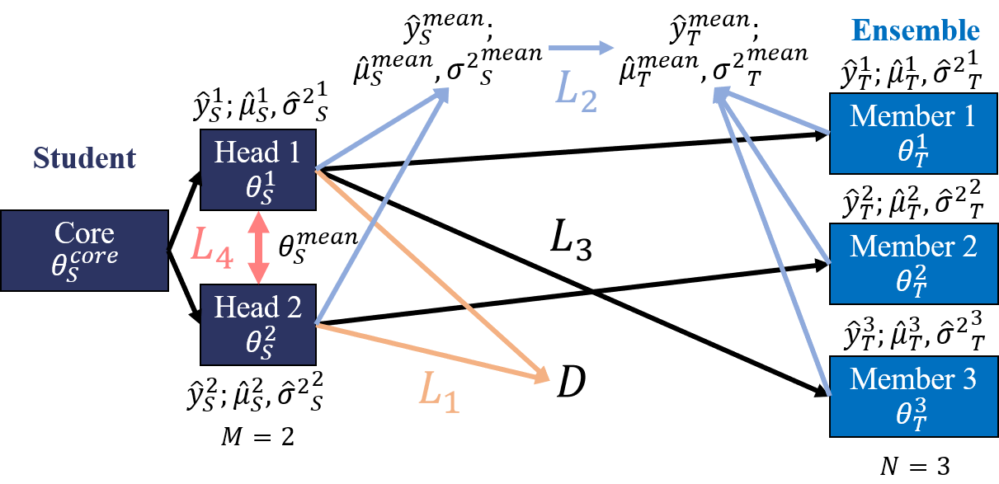

# Simple Regularisation for Uncertainty-Aware Knowledge Distillation

by Martin Ferianc (martin.ferianc.19@ucl.ac.uk) and Miguel Rodrigues.

This repository presents simple regularisation that can be applied to train multi-headed models for knowledge distillation. The regularisation is based on the idea: to minimise the similarity between the heads through minimising their cosine similarity applied to their weights.

The paper can be found at: [https://arxiv.org/abs/2205.09526](https://arxiv.org/abs/2205.09526)
The poster is at [here](./poster.pdf)

- [Simple Regularisation for Uncertainty-Aware Knowledge Distillation](#simple-regularisation-for-uncertainty-aware-knowledge-distillation)
  - [Abstract](#abstract)
  - [Software implementation](#software-implementation)
  - [Getting the code](#getting-the-code)
  - [Dependencies](#dependencies)
  - [License](#license)
    - [Citation](#citation)
  - [Credits](#credits)



Student with a core and M=2 heads is matched with ensemble consisting of N=3 members. Training is performed with respect to the 4 loss components: L_1 correctness,  L_2 aggregation, L_3 individuality and L_4 diversity.

## Abstract

Considering uncertainty estimation of modern neural networks (NNs) is one of the most important steps towards deploying machine learning systems to meaningful real-world applications such as in medicine, finance or autonomous systems. At the moment, ensembles of different NNs constitute the state-of-the-art in both accuracy and uncertainty estimation in different tasks. However, ensembles of NNs are unpractical under real-world constraints, since their computation and memory consumption scale linearly with the size of the ensemble, which increase their latency and deployment cost. In this work, we examine a simple regularisation approach for distribution-free knowledge distillation of ensemble of machine learning models into a single NN. The aim of the regularisation is to preserve the diversity, accuracy and uncertainty estimation characteristics of the original ensemble without any intricacies, such as fine-tuning on additional data. We demonstrate the generality of the approach on combinations of toy data, SVHN/CIFAR-10, simple to complex NN architectures and different tasks.

## Software implementation

All source code used to generate the results for the paper is in this repository.

The results can be replicated by following the instructions/commands in the `experiments/scripts.sh` file. Note that the paths there are with respect to the experiments generated in our environment and you might need to replace the respective paths with your own.

## Getting the code

You can download a copy of all the files in this repository by cloning the [git](https://git-scm.com/) repository:

    git clone https://github.com/martinferianc/hydra_plus.git

## Dependencies

You will need a working Python environment to run the code. Specifically we used Python 3.9.7.

The recommended way to set up your environment is through the [virtual environment](https://docs.python.org/3/library/venv.html#:~:text=A%20virtual%20environment%20is%20a,part%20of%20your%20operating%20system.) and the `./requirements.txt` which we provide in the root of the repository. 

```
python3 -m venv /path/to/new/virtual/environment
source /path/to/new/virtual/environment/bin/activate
pip3 install -r requirements.txt
```

### Notes 

1. Note that, you will see that the code mentions tails, but heads are mentioned in the paper. This is because we were conceptually experimenting with different ideas in the code, however, in the end we went with the "heads" concept. The code works as it is and it enables us to replicate the results and hence we did not want to change it and somehow break it.

2. The [KL divergence for the classification](https://github.com/martinferianc/hydra_plus/blob/main/kd/training/losses.py#L5) is not exactly the same as in the paper. Again this one has been used during the experimentation and we actually found out that even though, logically, the gradients should be the same after omitting the log teacher term (assuming it as a constant) they are not the same on a GPU! If run on a CPU, the gradients with or without the constant term are the same. No idea why this is happening. The "right" version would simply be: `torch.sum(p * (- torch.log(q+1e-8)), dim=-1).mean()`.

## License

All source code is made available under a BSD 3-clause license. You can freely use and modify the code, without warranty, so long as you provide attribution to the authors. See LICENSE.md for the full license text.

The manuscript text is not open source. The authors reserve the rights to the article content. If you find this work helpful, please consider citing our work:

### Citation

```
@misc{https://doi.org/10.48550/arxiv.2205.09526,
  doi = {10.48550/ARXIV.2205.09526},
  url = {https://arxiv.org/abs/2205.09526},
  author = {Ferianc, Martin and Rodrigues, Miguel},
  keywords = {Machine Learning (cs.LG), Artificial Intelligence (cs.AI), FOS: Computer and information sciences, FOS: Computer and information sciences},
  title = {Simple Regularisation for Uncertainty-Aware Knowledge Distillation},
  publisher = {arXiv},
  year = {2022},
  copyright = {arXiv.org perpetual, non-exclusive license}
}
```

## Credits

- https://github.com/lennelov/endd-reproduce - For help with the implementation of EnDD

We additionally thank DFUQ'22 workshop reviewers for feedback and encouragement.
